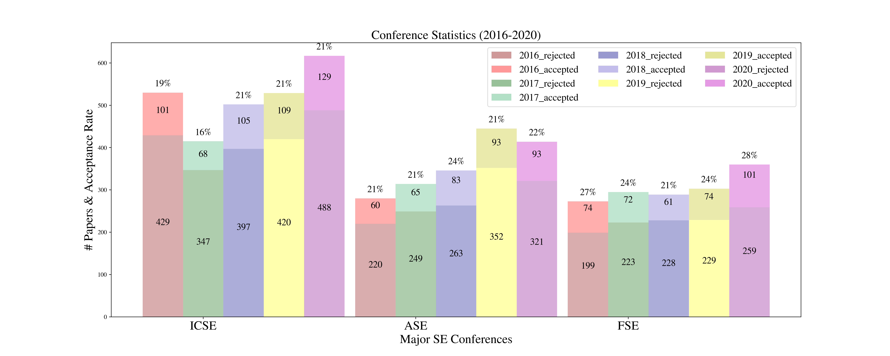

# Statistics of acceptance rate for the main SE and AI conferences
- [Domain](#conferences)
  * [Software Engineering](#software-engineering)
  * [Natural Language Processing and Computational Linguistics](#natural-language-processing-and-computational-linguistics)
  * [Machine Learning and Learning Theory](#machine-learning-and-learning-theory)
  * [Artificial Intelligence](#artificial-intelligence)
  * [Data Mining and Information Retrieval](#data-mining-and-information-retrieval)

## Software Engineering
|   Conference | Long  |  Short |Other |
|:-------|:----------|:-----------|:-----------|
|ICSE’21| 23%(138/602)| 
|ICSE’20| 20.9%(129/617)| 
|ICSE’19| 20.6%(109/529) | 
|ICSE’18| 20.9%(105/502)  | 
|ICSE’17| 16.4% (68/415) | 
|ICSE’16| 19.1%(101/530) | 
|ICSE’15| 18.5%(84/452)| 
|ICSE’14| 20.0%(99/495)|   
|ICSE’13| 18.5%|   
|ICSE’12| 21.3% (87/408) | 
|ASE'20|22.5%(93/414) |
|ASE'19| 21%(93/445)|
|ASE'18|24.0%(83/346)|
|ASE'17|21% (65 / 314)|
|ASE'16|19% |
|ASE'15|21% (60 / 289)|
|ASE'13|16% (51 / 317|
|ASE'12|15.2% (21/138)|
|ESEC/FSE'20|28.1%(101/360)|
|ESEC/FSE'19|24.4%(74/303)|
|ESEC/FSE'18|21%(61/289|
|ESEC/FSE'17|24.4%(72/295)|
|ESEC/FSE'16|27.1%(74/273) |
|ESEC/FSE'15|25% (74 / 291)|
|ESEC/FSE'14|22%(61/273)|
|ESEC/FSE'13|20%|
|ESEC/FSE'12| 17.4% (35/201).|
|ISSTA'20|(43/162) 26.5%|
|ISSTA'13|25.8%(32/124) |
|ICSME'20|(58/201)28.9%|
|ICSME'19|23%|
|ICSME'18|22% (37/174)|
|ICSME'17|(42/151)27.8% | 
|OOPSLA'20|(109/302) 36%|
|ICPC 2020|(32/84) 38.1%|

## Natural Language Processing and Computational Linguistics

|   Conference | Long  |  Short |Other |
|:-------|:----------|:-----------|:-----------|
|ACL'20 |25.4% (571/2244)|  17.6% (208/1185)||
|ACL'18 |25.3% (258/1018)|  24.0% (126/526)||
|ACL'19 |25.7% (447/1737)|  18.2% (213/1168)||
|ACL'17 |25.0% (195/751) |  18.9% (107/567)||
|ACL'16 |28.0% (231/825) |  21.0% (97/463)||
|ACL'15 |25.0% (173/692) |  22.4% (145/648)||
|ACL'14 |26.2% (146/572) |  26.1% (139/551)||
|EMNLP'20|22.4% (754/3359) (Long+Short)|-|15.5% (520/3359) (Findings)|
|EMNLP'19|25.6% (465/1813)| 20.5% (218/1063)||
|EMNLP'18|25.5% (351/1376)| 23.2% (198/855)||
|EMNLP'17|25.8% (216/836)|  18.4% (107/582)||
|EMNLP'16|25.8% (177/687)|  21.8% (87/400)||
|EMNLP'15|26.2% (157/600)|  22.1% (155/700)||
|EMNLP'14|30.4% (155/510)|27.8% (70/252)||

## Machine Learning and Learning Theory

|   Conference | Long  |  Short |Other |
|:-------|:----------|:-----------|:-----------|
|NeurIPS'20|    20.1% (1900/9454)| -|(105 orals, 280 spotlights and 1515 posters)|
|NeurIPS'19|    21.1% (1428/6743)| -|(36 orals, 164 spotlights and 1228 posters)|   
|NeurIPS'18|    20.8% (1011/4856)|-| (30 orals, 168 spotlights and 813 posters) |
|NeurIPS'17|    20.9% (678/3240) |-|(40 orals, 112 spotlights and 526 posters)  |
|NeurIPS'16|    23.6% (569/2403)|   -|
|NeurIPS'15|    21.9% (403/1838)|   -|
|NeurIPS'14|    24.7% (414/1678)|   -|
|ICLR'21| 28.7% (860/2997) | - |(53 orals, 114 spotlights and 693 posters) | - |
|ICLR'20| 26.5% (687/2594) | - |(48 orals, 107 spotlights and 532 posters) | - |
|ICLR'19| 31.4% (500/1591) | - |(24 orals and 476 posters) |
|ICLR'18 | 32.0% (314/981) |- |(23 orals and 291 posters) | 
|ICLR'17 | 39.1% (198/507) |- | (15 orals and 183 posters) |
|ICLR'16 | - | - |
|ICLR'15 | - | - |
|ICLR'14 | - | - |
|ICML'21|21.5%(1184/5513)|-|
|ICML'20 | 21.8% (1088/4990) | - |
|ICML'19 | 22.6% (773/3424) | - |
|ICML'18 | 25.1% (621/2473) | - |
|ICML'17 | 25.9% (434/1676) | - |
|ICML'16 | 24.0% (322/?) | - |
|ICML'15 | 26.0% (270/1037) | - |
|ICML'14 | 15.0% (Cycle I), 22.0% (Cycle II) | - |

## Artificial Intelligence

| Conference  | Long Paper  | Short Paper  |Other |
| ------------- |:-------------|:-----|:-----|
|AAAI'21 | 21.4% (1692/7911) | - |
|AAAI'20 | 20.6% (1591/7737) | - |
|AAAI'19 | 16.2% (1150/7095) | - |
|AAAI'18 | 24.6% (933/3800) | - |
|AAAI'17 | 24.6% (638/2590) | - |
|AAAI'16 | 25.8% (549/2132) | - |
|AAAI'15 | 26.7% (531/1991) | - |
|AAAI'14 | 28.0% (398/1406) | - |
|IJCAI'20 | 12.6% (592/4717) | - |
|IJCAI'19 | 17.9% (850/4752) | - |
|IJCAI'18 | 20.5% (710/3470) | - |
|IJCAI'17 | 26.0% (660/2540) | - |
|IJCAI'16 | 24.0% (551/2294) | - |
|IJCAI'15 | 28.6% (572/1996) | - |
|IJCAI'13 | 28.0% (413/1473) | - |

## Data Mining and Information Retrieval

|   Conference | Long  |  Short |Other |
|:-------|:----------|:-----------|:-----------|
|CIKM'20 | 21.0% (193/920) | 25.9% (103/397) |
|CIKM'19 | 19.6% (202/1031)| 22.7% (107/471) | 21.8% (38/174m applied research)|
|CIKM'18 |  17% (147/826)| 23% (96/413) | 25% (demo), 34% (industry paper) |
|CIKM'17 | 20% (171/855)| 28% (119/419)| 38% (30/80, demo paper)         |
|CIKM'16 | 23% (160/701)| 24% (55/234)| 54 extended short papers (6 pages) |
|KDD'20 | 16.9% (216/1279) | - |
|KDD'19 | 14.2% (170/1200) (110 orals and 60 posters) | - |
|KDD'18 | 18.4% (181/983) (107 orals and 74 posters) | - |
|KDD'17 | 17.4% (130/748) | - |
|KDD'16 | 13.7% (142/1115) | - |
|KDD'15 | 19.5% (160/819) | - |
|KDD'14 | 14.6% (151/1036) | - |
|ICDM'20 | 9.8% (91/930) | 9.9% (92/930) |
|ICDM'19 | 9.1% (95/1046) | 9.5% (99/1046) |
|ICDM'18 | 8.9% (84/948) | 11.1% (105/948) |
|ICDM'17 | 9.3% (72/778) | 10.7% (83/778) |
|ICDM'16 | 8.6% (78/904) | 11.0% (100/904) |
|ICDM'15 | 8.4% (68/807) | 9.7% (78/807) |
|ICDM'14 | 9.8% (71/727) | 9.8% (71/727) |
|SIGIR'21 | 21.0% (151/720) | 27.6% (145/526) |
|SIGIR'20 | 26.5% (147/555) | 30.2% (153/507) |
|SIGIR'19 | 19.7% (84/426) | 24.4% (108/443) |
|SIGIR'18 | 21.0% (86/409) | 30.0% (98/327) |
|SIGIR'17 | 22.0% (78/362) | 30.0% (121/398) |
|SIGIR'16 | 18.0% (62/341) | 30.6% (104/339) |
|SIGIR'15 | 20.0% (70/351) | 31.3% (79/252) |
|SIGIR'14 | 21.0% (82/387) | 40.0% (104/263) |

