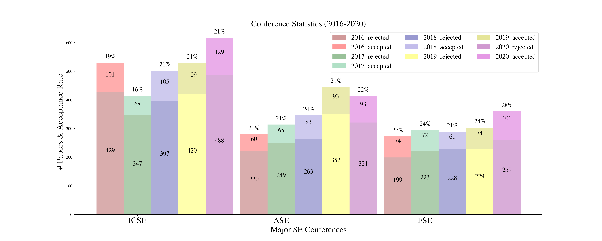

## SE
|Conf   | 2021          |  2020         |2019           |2018           |2017           |
|:------|:----------    |:-----------   |:-----------   |:-----------   |:-----------   |
|ICSE   |23%(138/602)   |20.9%(129/617) |20.6%(109/529) |20.9%(105/502) |16.4%(68/415)  |
|ASE    |               |22.5%(93/414)  |21%(93/445)    |24.0%(83/346)  |21%(65/314)    |
|FSE    |               |28.1%(101/360) |24.4%(74/303)  |21%(61/289)    |24.4%(72/295)  |
|ISSTA  |               |26.5%(43/162)  |               |               |               |
|OOPSLA |               |36%(109/302)   |               |               |               |
|ICSME  |               |28.9%(58/201)  |23%            |22%(37/174)    |27.8%(42/151)  |
|ICPC   |               |38.1%(32/84)   |               |               |               |

## NLP
|Conf       | 2021  |2020            |2019            |2018             |2017          |2016            |
|:------    |:------|:----------     |:-----------    |:-----------     |:-----------  |----            |
|ACL        |       |25.4% (571/2244)|25.7% (447/1737)|25.3% (258/1018)|25.0% (195/751)|28.0% (231/825) |
|ACL-short  |       |17.6% (208/1185)|18.2% (213/1168)|	24.0% (126/526)|18.9% (107/567)|21.0% (97/463)  |
|EMNLP      |       |22.4% (754/3359)|25.6% (465/1813)|25.5% (351/1376)|25.8% (216/836)|25.8% (177/687) |
|EMNLP-short|       |22.4% (754/3359)|20.5% (218/1063)|23.2% (198/855) |18.4% (107/582)|21.8% (87/400)  |

Notes:
|Conf       | Notes                     |
|:----------|---------------------------|
|EMNLP'20   |15.5% (520/3359) (Findings)|

## ML, AI
|Conf   | 2021           |2020             |2019             |2018             |2017            |
|:------|:----------     |:----------      |:-----------     |:-----------     |:-----------    |
|NeurIPS|                |20.1%(1900/9454) |21.1%(1428/6743) |20.8%(1011/4856) |20.9% (678/3240)|
|ICLR   |28.7%(860/2997) |26.5%(687/2594)  |31.4%(500/1591)  |32.0%(314/981)   |39.1%(198/507)  |
|ICML   |21.5%(1184/5513)|21.8%(1088/4990) |22.6%(773/3424)  |25.1%(621/2473)  |25.9%(434/1676) |
|AAAI   |21.4%(1692/7911)|20.6% (1591/7737)|16.2% (1150/7095)|24.6% (933/3800) |24.6% (638/2590)|
|IJCAI  |                |12.6% (592/4717) |17.9% (850/4752) |20.5% (710/3470) |26.0% (660/2540)|

## DM, IR

|Conference | 2021         | 2020          | 2019          | 2018         | 2017         | 2016          |
|:-------   |:----------   |:-----------   |:---------     |:-----------  |:-----------  |------         |
|CIKM       |              |21.0%(193/920) |19.6%(202/1031)|17%(147/826)  |20%(171/855)  |23%(160/701)   |
|CIKM-Short |              |25.9%(103/397) |22.7% (107/471)|23% (96/413)  |28%(119/419)  |24%(55/234)    |
|KDD        |              |16.9%(216/1279)|14.2%(170/1200)|18.4%(181/983)|17.4%(130/748)|13.7%(142/1115)|
|ICDM       |              | 9.8% (91/930) | 9.1% (95/1046)|8.9% (84/948) |9.3% (72/778) |8.6% (78/904)  |
|ICDM-short |              | 9.9% (92/930) |9.5% (99/1046) |11.1%(105/948)|10.7% (83/778)|11.0% (100/904)|
|SIGIR      |21.0%(151/720)|26.5% (147/555)|19.7% (84/426)|21.0% (86/409)|22.0% (78/362)|18.0% (62/341)|
|SIGIR-short|27.6%(145/526)|30.2% (153/507)|24.4% (108/443)|30.0% (98/327)|30.0% (121/398)|30.6% (104/339)|

Notes:
|Conf       | Notes                             |
|:----------|-----------------------------------|
|CIKM'19 | 21.8% (38/174m applied research)|
|CIKM'18 |   25% (demo), 34% (industry paper) |
|CIKM'17 |  38% (30/80, demo paper)         |
|CIKM'16 |  54 extended short papers (6 pages) |

