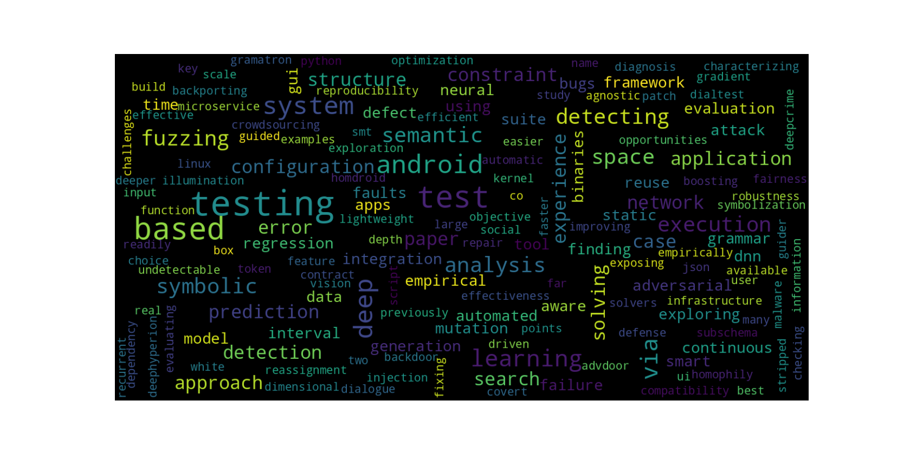
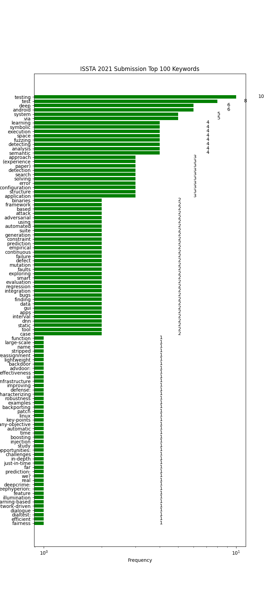

## ISSTA 2021 Paper-Statistics
51 papers are acceptted,

265 different keywords before merging

256 different keywords after merging

##  ISSTA 2021 Paper Keywords Statistics

Most of the top keywords

['testing', 'test', 'deep', 'android', 'system', 'via', 'learning', 'symbolic', 'execution', 'space']
 

* Test in Android
* test deep learning method
* symbolic execution

## 

### Question:
what is different between testing and test?